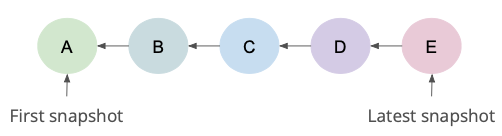
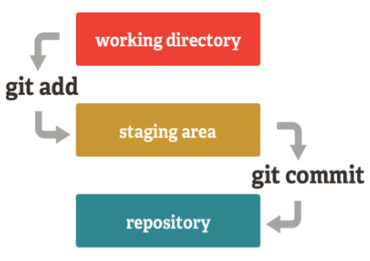
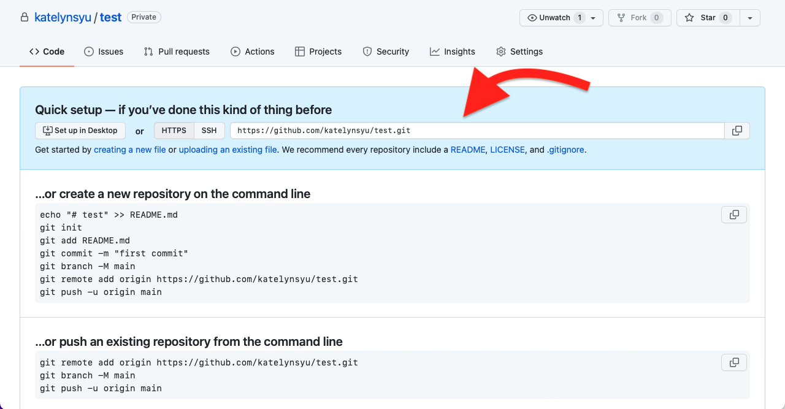
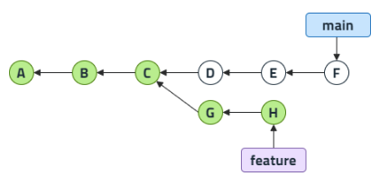
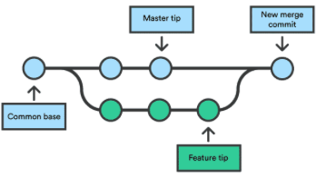
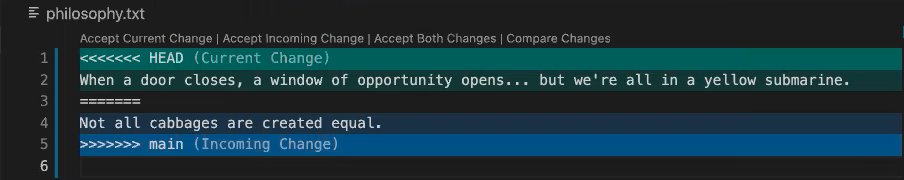
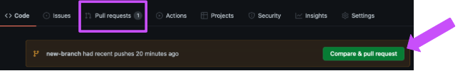
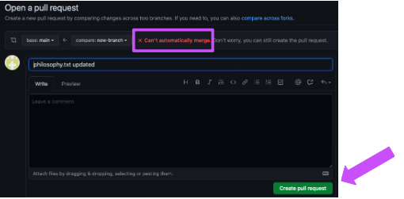
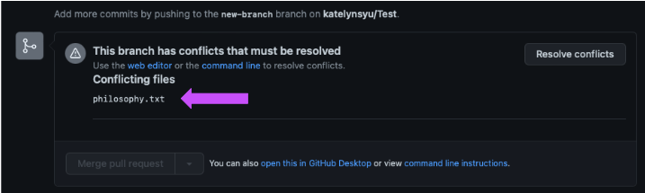
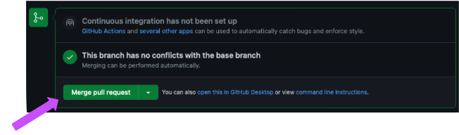

# Hack on the Hill 9 - Intro to Version Control: Git

**Date**: February 26, 2022

**Location**: Zoom

**Teacher**: [Katelyn Yu](https://github.com/katelynsyu)

Welcome. welcome to our Intro to Git Version Control workshop's README!!! I hope this workshop helps you 
understand git a little better, so happy hacking!

## Resources
- [Slides](https://docs.google.com/presentation/d/11Gb0WyIzhGyTfzxS0bg_IhUuvTgwYifyVpzmMK8aOmg/edit#slide=id.g113b2df1613_0_4)
- [Workshop Recording](https://youtu.be/YWEOSz7Lo8U)

## What we'll be learning today
- [Introducing git](#introducing-git)
    - [What is git?](#what-is-git)
    - [Why do we use git?](#why-do-we-use-git)
    - [Installing git](#installing-git)
    - [Configuring git](#configuring-git)
    - [Conceptualizating git](#conceptualizing-git)
    - [The git workflow](#the-git-workflow)
    - [More helpful workflow commands](#more-helpful-workflow-commands)
- [Collaborating with GitHub](#collaborating-with-github)
    - [What is GitHub](#what-is-github)
    - [The relationship between git and GitHub](#the-relationship-between-git-and-github)
    - [Setting up GitHub](#setting-up-github)
    - [Git collaboration commands](#git-collaboration-commands)
- [Branching](#branching)
    - [Introducing branching](#introducing-branching)
    - [What are branches in git?](#what-are-branches-in-git)
    - [How do we branch?](#how-do-we-branch)
    - [Pushing and pulling branches](#pushing-and-pulling-branches)
- [Merging](#merging)
    - [Introducing merging](#introducing-merging)
    - [What is merging in git?](#what-is-merging-in-git)
    - [Merge conflicts](#merge-conflicts)
    - [Merge commands](#merge-commands)
    - [How do we merge?](#how-do-we-merge)
- [Extra Resources and Tidbits](#extra-resources-and-tidbits)
    - [Helpful Tidbits (Git Edition)](#helpful-tidbits-git-edition)
    - [Helpful Tidbits (Bash Edition)](#helpful-tidbits-bash-edition)
    - [Extra Resources](#extra-resources)

## Introducing git
### What is git?
Git is an *open-source, distributed version control software*. What does that mean?

Let's side track and talk about video games first, specifically save points.
Save points you to save all the progress that you have made so far. Essentially, they allow you 
to save the current state of your game. Then at some point down the line, say you make a mistake. 
Since you have a save point, you can go back to the state the game was in when you saved it earlier 
and continue playing from there, correcting your mistake without having to replay your game from the beginning. 

Right. Amazing. Cool. How do video games have anything to do with git?

Well, **save points** are to **video games** as **git** is to **program development**. (If you've never seen this 
kind of logical analogy before, I envy your clearly more-idyllic-than-mine childhood.) All this means is that git 
works as the save points of program development. Git, as a version control software, helps you keep track of the 
versions of your program the same way that save points keep track the versions your game went through. With git, 
you are able to save snapshots of the states of all of our files. By state, I mean what files are in your project 
folder and what the code looks like in each of those files. Using git, you can refer back to these snapshots at a 
later time to see what has changed between then and now. You can even revert your program to that previous state.

Taking snapshots with git is very different from just saving your file. Saving your file only tracks the most recent 
version of that file. Once you save, previous saved version of the file disappear and are no longer accessible. 
With git, those previous versions are still accessible, making git a very powerful tool to have in your metaphorical 
back pocket.

### Why do we use git?
Let's go back to that video game analogy of ours. Imagine you're zipping through your video game, and you're having 
a great time, and no, you will not be using save points because save points are for noobs. Then, BOOM. You made a 
mistake. You died! Game Over! And look at that... you don't have a save point. You have to start the game all over 
again—goodbye progress, hello new game. Sucks right?

The same thing is gonna happen to your code. You can definitely yolo it and not use version control softwares like 
git and maybe things will work out. However, I guarantee that the larger your project is and the more intense coding 
becomes, the higher chance that something will be messed up at some point. Then, you'll have a minor aneurysm trying 
to figure out what went wrong. You might have to replace your ctrl-z buttons and the world's on fire as your brain 
shuts down as you try to decipher 150 lines of error messages that weren't there 15 minutes ago.

*TL;DR: please use git. I'm not trying to make your life harder! I'm honestly trying to make it easier, and though 
git might be a little difficult to begin learning, I swear that the benefits outweigh the drawbacks.*

### Installing git
Git is a command line tool accessed through the terminal. This means that you have to install git in the terminal.
To find the terminal, go to your finder and type in 'terminal'. Your terminal should pop up. If you are a windows user, 
you might find it by typing 'command prompt' or 'powershell'. 

**Note**: commands that are supposed to be typed in the terminal will be prepended with a `$`. When typing these 
commands into the terminal, don't type the `$`. For example if the command given is `$ git init`, only type `git init` 
into your terminal.

- **Linux**

In your terminal type:
```git
$ sudo apt-get install git-all
```
This will install git for you. Congrats!

- **Mac**

Macs have a two-step installation process.

First, you have to install the Homebrew Package Manager with the command:
``` git
$ /bin/bash -c "$(curl -fsSL https://raw.githubusercontent.com/Homebrew/install/HEAD/install.sh)"
```

Then, after an unearthly amount of waiting time, you get to type:
``` git
$ brew install git
```
to install git. Voilà! You've got git on your computer now!

- **Windows**

Congratulations, windows-users! You special cookies get to follow this link right here: 
[direct installation](https://gitforwindows.org).
That link will give you a thorough process outline to downloading git onto your device. Godspeed and good luck :)

### Configuring git

You have to configure git so that it knows stuff about you. This is important because if you are working in a git
repository with a bunch of people, git can list who exactly created what change at what time and how to get in
contact with them. 

What do I mean by repository? A repository (often called a rep) is a fancy name for the collection of all files 
in your folder that gill will be tracking (ie. paying attention to, recording the history of) and the history of 
changes made to them.

You can set your name in git using the command:
``` git
$ git config --global user.name "John Doe"
```

Set your email in git with this command:
``` git
$ git config --global user.email johndoe@example.com
```

### Conceptualizing git

***What does saving with git look like?***

Conceptually, imagine the whole set of save points you make to exist like this diagram here:



Each circle represents a save point, a snapshot of the state your files were in when you saved that time.
Each circle points to the previous one: E to D, D to C, etc. This means that snapshot E, the snapshot that has no
arrows pointing to it, is the latest snapshot, the latest saved state of the program. E points to D which is the
second-to-last saved  version of the program. So on, so forth. Then, snapshot A, which does not point to a snapshot,
is the first saved version of the program. In this way, git allows us to create a timeline of the evolution of our 
program.

### The git workflow

How do we go from our project files on our computer to the timeline of save points? Now introducing: the git workflow!

The git workflow has three stages: the working directory, the staging area, and the repository. Let's break this down.



- **The Working Directory**

The working directory exists on your personal device. It is the folder you are working in to create your project (ie.
the folder that has all the files that you want git to keep snapshots of).

In order to save the state of the files in the working directory, you have to introduce git to it. How?
Type this command in your project folder:
``` git
$ git init
```
`$ git init` creates an empty git repository in the folder you are currently in in the terminal. What does this mean? It 
means that by typing this command, git will begin to track what happens in the folder it is in. Since it has not been 
told to save anything yet, it has an empty timeline, like save point slots that have no save points in them.

- **The Staging Area**

The staging area is the next part of the git workflow, but what is it?

The staging area holds all the changes you've made to your files that you want git to include in the next "save point" 
of your program. The staging area tells git to pay attention to the files that are included here because the developer
wants to track the changes to these files over time.

How do you get files from the working directory to the staging area? Use this command:
``` git
$ git add [file(s)/folder(s)]
```
Once you have gotten your project to a state that you would like to save as a snapshot, call the `$ git add` command and
list the files and folders that you want included in the snapshot. If you would just like to include everything in the
working directory, you can use the command `$ git add .` This command does not create the snapshot. It only puts 
everything that needs to be added to the snapshot in one place.

- **The Repository**

The final stage of the workflow is the repository. The repository is the collection of all the snapshots of the project 
in a timeline, enabling easy tracking regarding how the program has changed over time. This is essentially the diagram 
of circles displayed below that I stole from the [conceptualizing git](#conceptualizing-git) section.


What are these snapshots that I keep mentioning though? We can answer this now with our understanding of the git workflow.
Snapshots are everything that was in the staging area bundled up in a wrapper and displayed as one cohesive object.

How do we get our files from the staging area into a snapshot in the repository? You need to use the command `$ git commit`.
This command packages up everything in the staging area into a commit and puts the commit into the repo. What is a commit?
A commit is the technical term for a snapshot of the repo. It stores who made the changes that were saved and when the
changes were made. However, I recommend that you use this version of git commit command:
``` git
$ git commit -m "[your succinct and informative commit message]"
```
This version of the command allows you to give a commit message for each commit made. This is because commit messages 
explain why the changes in the commit were made and allow viewers of the repository to understand the motivation behind each 
incremental change to the project. Thus, including a commit message is considered good practice.

### More helpful workflow commands

- `$ git status`

This command will display which files you have changed since your last commit. It will also tell you whether you have staged 
these files or not (ie. Have you put these files in the staging area? Is git tracking changes to these files?)

- `$ git log`

This command allows you to see the list of commits in a repo with the top entry being the most recent and subsequent commits 
being progressively older. It essentially gives a text version of this commit history diagram I revived from the 
[conceptualizing git](#conceptualizing-git) section.


For each snapshot in the repo, `$ git log` will list who committed, when they committed, and the commit message. This is why 
commit messages are so important to include. With commit messages, people know what a commit does and they can easily track 
how a program evolved.

- `$ git restore [file(s)]`

This command undoes the changes you applied to your working direcory until it matches the state it was in when you last 
committed. It essentially allows you to start programming from your last save point.

- `$ git restore --staged [file(s)/folder]`

Say you staged a file, then you decide that you actually don't want git to track this file or you don't want your next commit
to include the changes you added to this file. Use `$ git restore --stages [file]` to unstage these files, and then you can
commit as normal or continue working.

## Collaborating with GitHub

Git is actually very useful when you want to collaborate on a project with others. How do we do it though?
Like every multiplayer game out there, we need a server or some space on the internet in which we can see what other people 
are doing in the game and interact with their progress to help us finish our game.

...Can we use google drive? Nah. Hold onto your socks, folks, we're gonna talk about collaborating using GitHub.

### What is GitHub?

What is GitHub? It's a git-based version control system in the cloud. This essentially means that GitHub is a website that
allows you to create an online repo (often called a remote repo) so that you can further save your commit history (the 
history of snapshots you have made) and share your code among multiple people. With GitHub, it's easy to download the online 
repo's code, create commits on your local copy of the repo, and then submit these changes to the remote repo.

Let me also emphasize exceedingly emphatically that git is not the same thing as GitHub. GitHub is the cloud version of the
repository that everyone can see and download, edit the commit history of, and then submit their changes to. Git is the version
control system on our devices. Practically, we will be using git locally and using GitHub to receive and send code amongst our
collaborators.

### The relationship between git and GitHub

GitHub and each device that submits changes to the project all have their own individual copies of the repository. The
version on GitHub is called the 'master' version. Each copy on a personal device is called a 'local' copy. Using git, we can
download 

*Why have individual copies of the repo for GitHub and each device?*

Mainly for safety reasons. If there was a shared coding space between all people like a google doc, it would be much easier for
bugs to be introduced to the program. If one person introduces faulty code into the project files, everyone's version of the code
stops working. This makes it very hard to debug and difficult to ensure that there is always a non-problematic version of the project 
to refer back to. On the other hand with separate copies, if one person inserts buggy code into their copy of the project files, only 
their version of the project falls to pieces. Other people still have a working project. The person with the buggy code can now
redownload the working version from the master copy and then everything will work again. Separate copies are just another way to
create futher safety nets for everyone in the collaboration process.

### Setting up GitHub

**Everyone on your team** has to create a [GitHub account](https://github.com/). I recommend you use the same email that you used
when configuring git.

**One person on your team** has to create a local repo and a GitHub repo and link the two repositories together so they can talk
to one another. To do this:
1. create a [GitHub repo](https://github.com/new)
    1. Make sure that this repo is public
    2. There will be checkboxes for adding a .gitignore or a README.md. Don't check them. I'll explain what they are later and if
    you want them then, you can add them.
2. create a repo on your personal device in the folder of your choice.
    1. you can do this with `$ git init`
3. create a commit in this repo
    1. the easiest way to do this is by adding a some text in a new file
    2. add your changes to the staging area: `$ git add .`
    3. commit the files in the staging area to the repo: `$ git commit -m "[message]"`
4. bind and sync the remote repo to your local repo
    1. `$ git remote add origin [GitHub repo url]`
    2. `$ git branch -M main`
    3. `$ git push -u origin main`

Let me elaborate more on step 4 because it's quite dense and includes a lot of new things we haven't covered. Firstly after step 1,
GitHub will send you to a page where you can find your GitHub repo link. The page should look something like this, where the red
arrow points to the repo link you should use for step 4.1:



In total, step 4 takes the online repo and links it to the one you create locally on your device in step 2. With these two repos
linked, you can now get the code in the GitHub repo onto your device and you can submit your local repository and its changes to 
GitHub to change the state of the GitHub repository. Additionally, this step syncs the remote repo to your local one, so now the
remote has all the commits you have made in your local repo instead of being an empty repo.

**Everyone else on the team** has to get a copy of the master version of the repository onto their devices now. You can do this
with the `$ git clone [GitHub repo url]` command. The url is the same one used in step 4.1 when the chosen one of the group linked
their local repo to the remote.

This command will essentially create a copy of the master version of the repo in whatever folder you are currently in and link
the remote repo to this new local version. In this repo, you can download the latest eversion of the master copy, create your 
own commits, and then share these commits with the remote repo.

Easy peasy collaboration right?

### Git collaboration commands

I've mentioned before that you can submit the changes you made to your repo to the master version. How do we use git to do this?
```git
$ git push
```
This command essentially compares your local repo to the one on GitHub. If your repo has something that the GitHub one does not
have, it copies your changes to the online repo so that other people can get the most updated version of the code.

Incidentally, we used this git push command earlier when binding a remote repo to the local one. Now you know what it means!

It's kind of useless to only be able to push code to the remote repo. What if we want to edit the code on the master version
because it might have updates that our local version does not have? Thus, converse to `$ git push`, we have the command
```git
$ git pull
```
This command compares the repo on GitHub to your local repo. If the GitHub repo has something that your local repo does not
have, it copies these changes into your local repo, so you get the most updated version of the shared project

## Branching
### Introducing branching

Let's go back to that video game analogy—it's been working so far, and if it ain't broke, don't fix it.

We're playing a multiplayer game right now, and you want to speedrun this game. You want to get as much done in as short
an amount of time possible. How do you do this? 

Luckily, you're working with a team, and different people can complete different side quests all at the same time.
This idea of separating and working on a unique task is called **branching**.

You can do the same thing with your code. In your project, you are going to have different features. Rather than have 
everyone working on a singular feature all at one time, you can employ devision of labor and have everyone take up one
feature each. 

### What are branches in git?

In git, branches can be thought about conceptually like this: two alternate lines of commits and program development
pointing to singular commit somewhere.



*What do those arrows saying 'main' and 'feature' mean?*

Every single repo has a **main branch**. The main branch is the branch that everyone looks at to see the finished
product or the latest working version of the project. We try to only commit to main branch (ie the line of commits
that are pointed to by the word main) when we are absolutely, positively, 220% certain that our code is impeccable. 
This code is not in its developmental stages. It's got a 100% chance of working, and we want this code exactly as it
is in our final product.

You can add **feature branches** to your repo in order to develop 'features' of your program. Branches are isolated
development spaces where you can track the evolution of the code that you want to add to the final product but is
still in the works.

For example, say you're building a version of Instagram. The main branch would hold the final product that you're 
adding to as you create and perfect more features. The feature branches are where you work on each of those features
individually. You might have a branch for the messaging functionality of instagram, one for the creating posts 
feature, one for creating comments, and so on. Branches allow you to track the progress you are making when you aren't
ready to add what you have to the final product. 

### How do we branch?

- `$ git branch`

This command lists all of the branches that you have visited in your local repository. Git is also nice enough to 
highlight the branch that you are on in this list.

- `$ git branch -r`

This command lists all branches in the remote repository, ie all the branches that others have made and pushed
to the remote.

- `$ git branch [branch name]`
This version of the command allows you to create a new branch in your local repo that has the branch name that you list.

These above three commands are useful when you want to create new branches or see what branches already exist, but
they don't allow you to switch onto a branch and work in that isolated development evironment. If you start committing,
you'll still be committing to that main line of commits in the main branch.

- `$ git checkout [branch name]`

This command switches you onto the branch you name. If you type this command and then commit, you will be committing to
the alternate line of commits on the branch. Nothing you change will affect main (the main branch).

- `$ git checkout -b [branch name]`

This command is a helpful shortcut in that it squashes two commands into one: `$ git branch [branch name]` and 
`$ git checkout [branch name]`. In essence, it creates a new branch with the name that you passed into the command and 
then switches you onto that branch.

For newer versions of git, there's the `$ git switch` command.

- `$ git switch [branch name]`
This will switch you onto the branch name you list.

- `$ git switch -c [branch name]`
This command new branch and switches to that branch. And yes, this command is very similar to `$ git checkout`. It's up 
to you regarding which command you'd like to use.

### Pushing and pulling branches

You can also push and pull branches between the remote repo and your local copy to work with collaborators on your
branch.

To push branches:
```git
$ git push -u origin [branch name]
```
Do you remember this command from when we were initially linking the remote repo to the local repo? Specifically, 
the command used was `$ git push origin main`, which means that we were creating a main branch on our remote repo
and then taking our main branch and pushing the commits we had there to the remote repo.

Note: This command will push the branch you are currently on to the remote repo. Additionally, the branch name you
list in this command will be the name of the branch that will be created in the GitHub repo. I'd use the same branch
name in the remote repo as you have in your local repo just to avoid confusion. I also recommend that as soon as you
create a branch, you push it to remote just to be safe.

Pulling branches from remote is simple if you already have a local version of the branch. You simply do a `$ git pull`
and everything from the remote branch is downloaded to your local local branch.

If you do not have a version of the remote branch on your local repo, it's a multi-step process.
1. find a list of all remote branches with `$ git branch -r`
    1. all remote branches are listed in the format: `origin/[branch name]`
2. when you find the branch you are looking for among the remote branches, type `$ git checkout [branch name]`
    1. in this command when typing the branch name, ignore the 'origin/' part of the name
3. now you've got the remote branch on your local repo so you can `$ git pull` as normal.

## Merging
### Introducing merging

In our video game analogy, you and your teammates went off to do all the side quests individually. Now, you guys have
to come back together and bring all your progress together. Alone, you only had part of the game finished. Together,
you guys have completed the game. The act of sharing your progress for everyone to see and interact with is called
**merging**.

### What is merging in git?

In git, merging is when you unite two (or more, though I highly recommend only merging two) branches.

Say you were creating a version of Instagram, and you finished creating the post feature on your branch. Merging is
when you take the version of the project in the main branch and add the functionality of the finished feature you 
developed in your branch to it.

Conceptually in the repo, merging looks like the image below. You work on your branch until you decide that you have
finished development. Then you take main and your branch and you mash all the code together into one commit on the main
branch. Now your newest commit on main looks like the last commit on main plus your finished feature.



### Merge conflicts

Theoretically, merging works just fine... except for when it doesn't.

Let's imagine that in our video game analogy, two people ended up doing the same quest. Now you can't just automatically
smash everyone's progress together because two people's actions clasha nd mgiht have ended up with different results.
One person's progress overwrites another person's contribution and that is very much not great. This is in essence a
**merge conflict**. 

In git, merge conflicts occur when trying to merge two branches that have different code in the same corresponding region.
They rarely happen, but now you're going to be prepared to handle them. 

Merge conflicts look like this:



The format of the merge conflict is this:
- a line of less-than symbols followed by the word 'HEAD' or the words 'Current Change'.
    - 'HEAD' refers to the most recent commit on the branch you are on. 
- the code from the branch you are on
- a line of equal signs
- the code from the branch you are trying to merge in
- a line of greater-than symbols followed by the name of the branch you are trying to merge in or the words 'Incoming Change'

Breaking down this merge conflict, we see that the line "When a door closes, a window of opportunity opens... but we're
all in a yellow submarine" from the branch we are on is in the same place the line "Not all cabbages are created equal" is
in main. Thus, when asked to merge, git doesn't know which version to choose and asks you to choose either one version of
the code or integrate both versions.

To solve merge conflicts, delete the lines that do not pertain to the code you want to keep. You would delete the lines with
the the less-than signs, the equal signs, the greater-than signs, and the line of code that you do not want to keep.

Say you wanted to keep the line "When a door closes, a window of opportunity opens... but we're all in a yellow submarine"
from the image. To do so, you would have to delete lines 1, 3, 4, and 5.

### Merge commands

There is an intense process to merging—I will not lie. However, follow these steps and I swear everything will be fine.

First you need to know the command for merging.
```git
$ git merge [branch name]
```
The branch name listed is the branch that you want to merge into your current branch. 

***Please, for the sake of all that is good and non-stressful in this world, DO NOT call this command while on the main branch.***
You never want to touch main unless you know what you've got is impeccable. Always be on your feature branch and merge main onto
your branch. This is because when merging, you may face merge conflicts or unexpected bugs that you have to address, and we only
want to touch main when we know what we've got is safe. By merging main onto your feature branch, you are able to address these
problems on the feature branch, and everything is much safer this way.

There is also a command for if you change your mind about merging.
```git
$ git merge --abort
```
Call this command if you have already called `$ git merge [branch name]` and then decide you want to abort the merge.

### How do we merge?

1. on terminal, be on your feature branch
    1. check using `$ git branch`. The branch you are on will be highlighted
    2. if you are not on your branch, use `$ git checkout [branch name]` to get on your branch
2. on terminal, push to remote branch: `$ git push -u origin [branch name]`
3. Make a pull request on GitHub
    1. you'll find a notification with button to do this at the top of your GitHub repo

        

    2. a pull request is a safe and easy way for us to merge
    3. a pull request will also tell us whether there is a merge conflict or not

        

    4. If there is a merge conflict, it will tell us which files are affected

        

4. on terminal, update your main branch
    1. switch ack to main branch: `$ git checkout main`
    2. pull from remote: `$ git pull`
5. switch back to your feature branch: `$ git checkout [branch name]`
6. merge main to your branch: `$ git merge main`
7. fix the merge conflicts in the editor of your choice
8. commit your changes
    1. add your changes: `$ git add .`
    2. commit your changes: `$ git commit -m "[message]"`
9. push your changes to the remote repository: `$ git push -u origin [branch name]`
10. on GitHub, PR should be good to merge, so merge on GitHub

    

## Extra Resources and Tidbits

Time to go over some extra things that I've mentioned over the workshop that you don't need to know all too well, but 
understanding them will make life easier for you.

### Helpful Tidbits (Git Edition)

- .gitignore

I mentioned this when we were first creating our GitHub repo. A .gitignore is literally a file in your project's home
directory (directly in the project folder, not nested within further folders) that tells git which files to never 
include in the commits. It looks somewhat like this:
```git
ignore-me.txt			#ignores the text file ignore-me.txt
*.log				#ignores all files that end with .log
some_folder/       		#ignores the folder some_folder and all of its contents
```
If you want git to ignore a specific file, you can list that file inside the .gitignore. If you want git to ignore a
set of files with the suffix '.log', then you can type `*.log` in the .gitignore. If you wanted git to ignore a set of
files that begin with the letter 'a', you can also use the asterisk to do this by typing `a*`. The asterisk is just a
placeholder for a set of any characters. If you want git to ignore a folder and all of its contents, type the
folder's name followed by a slash. If you want to type a comment in the .gitignore, type a hashtag and then write your
comment.

- `$ git stash`

This command temporarily shelves the changes you have made to your working directory that have not been committed.
This allows you to switch branches and work on something else. You can always come back later and unshelve these changes 
and start working on them again.

- `$ git stash apply`

This command unshelves the changes you stashed with the last command.

Say you were working on a branch. You haven't committed yet, but you need to switch to another branch. To do so, you have
to called `$ git stash` then `$ git checkout` to get to the branch you want to go to. When you switch back to your 
original branch, you do `$ git stash apply` to unshelve your changes and continue working on them.

- `$ git diff --staged`

This command prints out all the differences between your staged files and the latest commit. It is especially useful if 
you’ve been away for a while and don’t remember what you’ve changed since your last commit.

- `$ git reset --soft HEAD~1`

This command tells the repo that the previous commit (second to last one made) is now the latest commit. In doing so, it 
reverts the state of the repo to that previous commit. However, this command is very nice because it does not delete the 
changes made since that commit. All of these changes are still in the working directory and will show up if you call 
`$ git status`.

- `$ git blame [file]`

If a bug has been introduced, you can use `$ git blame` on a file to find who wrote each line, the date they wrote it, and 
which commit they inputted this line in. With this information, you can do all sorts of detective work.

### Helpful Tidbits (Bash Edition)

- `cd`

`cd` means 'change directory'. This command can be used to move incrementally through folders or you can just change your
path completely. By incrementally, I mean that you can use `cd` to go into a folder that is within the folder you are 
currently in. An example of this is:
```bash
cd test-project
```
If you want to change paths completely, you can do:
```bash
cd /Home/Documents/new-folder
```
where each folder listed between slashes is a folder within the previous folder.

- `ls`

This command lists the files and folders that are in the folder you are currently in.

- `ls -a`

Like `ls`, this command lists files and folders for the folder you are currently in. However, this command also lists hidden
files like ., .., and .git.

### Extra Resources

- [Git Cheatsheet](https://www.git-tower.com/blog/git-cheat-sheet/)
- [Bash Commands Cheatsheet](https://www.educative.io/blog/bash-shell-command-cheat-sheet)
- ACM Hack officers and mentors!! We're here to help!!
