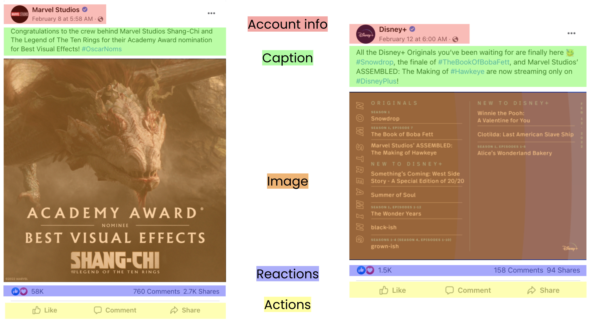
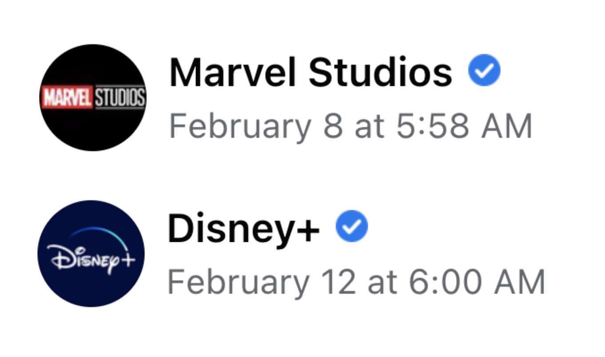
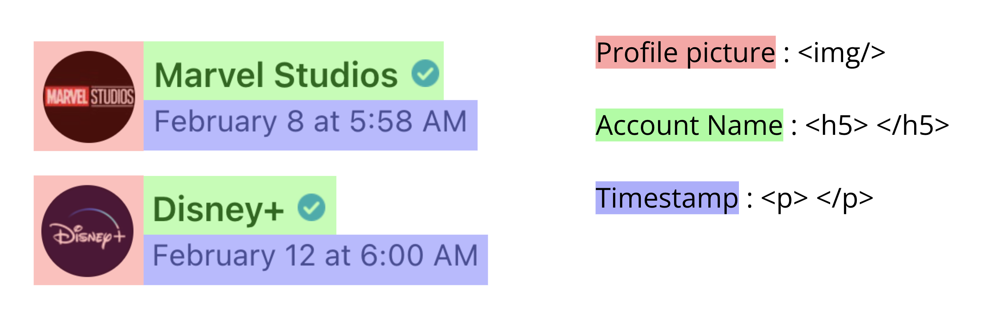
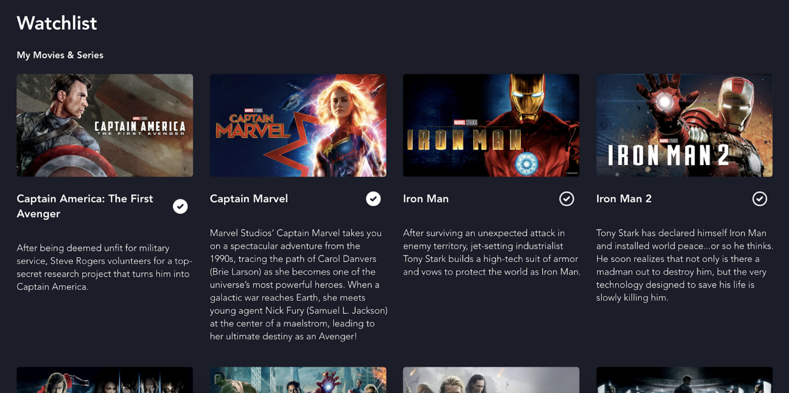
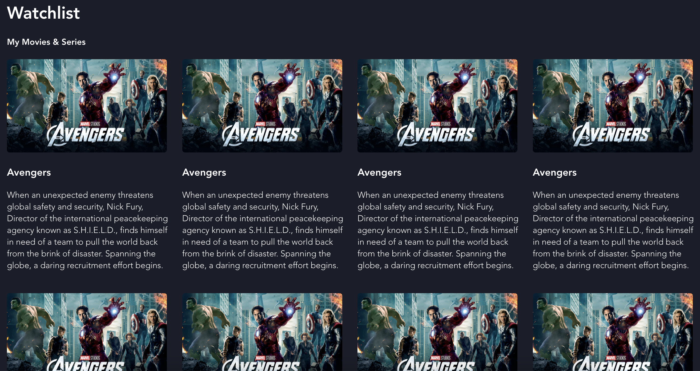
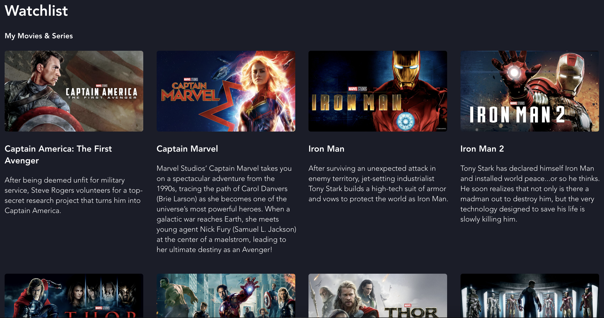
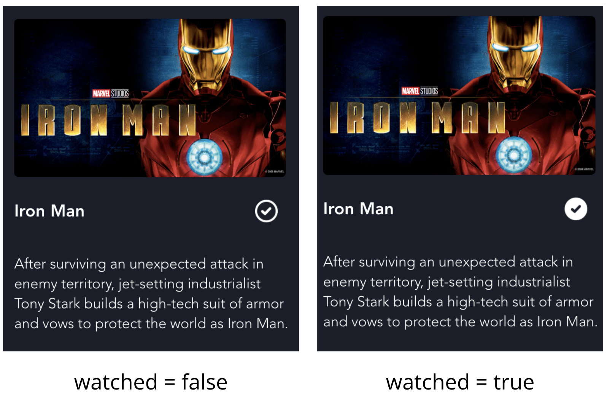
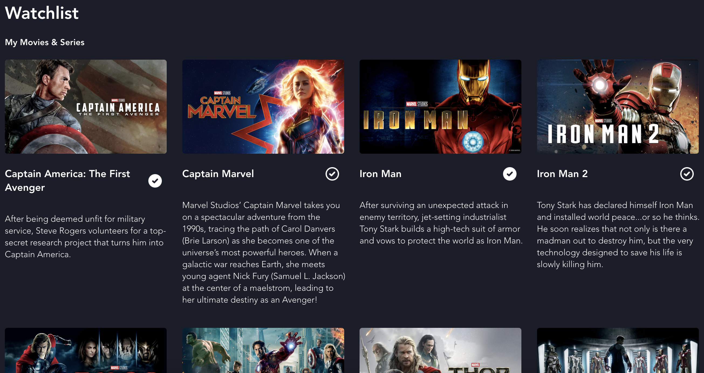

# Hack on the Hill 9 - Intro to Web Development: React.js

**Date**: February 26, 2022

**Location**: Zoom

**Teacher**: [Maggie Li](https://github.com/maggieelli)

Hello! Welcome to this introduction to web development using React.js workshop! If you aren't familiar with HTML/CSS/Javascript, make sure you watch the Intro to Frontend workshop first :)

## Resources
- [Slides](https://docs.google.com/presentation/d/1Q6-zbYOSTcvS5uN2GZHnxcpBYevpkj2HTGZImfVUEPc/edit?usp=sharing)
- Workshop Recording (coming soon)

## What we'll be learning today
- [Introducing React](#introducing-react)
    - [What is React?](#what-is-react)
    - [Why do we use React?](#why-do-we-use-react)
    - [JSX](#jsx)
    - [Rendering](#rendering)
    - [Setting up your React App](#setting-up-your-react-app)
- [Components](#components)
    - [What is a component?](#what-is-a-component)
    - [Functional components](#functional-components)
    - [Import and export](#import-and-export)
    - [Component demo](#component-demo)
- [Props](#props)
    - [What is a prop?](#what-is-a-prop)
    - [Using props](#using-props)
    - [Props demo](#props-demo)
- [State](#state)
    - [What is state?](#what-is-state)
    - [useState()](#usestate)
    - [State demo](#state-demo)
- [Other Resources](#other-resources)
    - [Node.js website](https://nodejs.org/en/download/)
    - [React.js website](https://reactjs.org/)

## Introducing React
### What is React?
React, which you will often see as React.js or ReactJS, is a **free and open-source front-end JavaScript library**. This means that anyone in the public, including you or me, can contribute to their code, as long as someone on their team approves it. React is becoming more and more widely used in web development. In fact, some of your favorite websites, including Facebook, Instagram, and Netflix are made with React. It is also one of the most sought-out skills in the industry, so it's great that you are taking the time to learn more about it!

### Why do we use React?
One of the main reasons that React is so popular is because of its ability to create **reusable UI components**. In the grand scheme of this, this means that we will have less repeated code - one of the main principles of software development. Another benefit of React is that it allows for very **efficient DOM updates**. This is because rather than updating the entire website every time there is a change, React only updates the individual components that have changed in an efficient manner. There are a couple main reasons why React is so powerful!

### JSX
In order to use React, you're going to need to learn some new syntax (sorry!). Luckily, this new syntax, JSX, is simply an add-on to Javascript, so some of it may look familiar. JSX **combines HTML and Javscript** to give us the ability to describe what UI components should look like. An example of this is the following line of code:
```JavaScript
const message = <h1>Welcome to HOTH!</h1>;
```
This line of code, which sets a variable message to what looks like an HTML tag, is completely normal JSX syntax. Furthermore, in JSX, we can **insert any valid Javascript expression using curly braces**. An example of this would be the following:

```JavaScript
const year = 9;
const message = <h1>Welcome to HOTH{year}!</h1>
```
This would display "Welcome to HOTH9!" We can also do this with functions, for example:
```JavaScript
const nameFunction = () => {
   return 'Hack';
};
const element = <h1>I love {nameFunction()}!</h1>;
```
This would display "I love Hack!" If we need to insert a JavaScript expression as an attribute, we can also do so with curly braces, like this:
```JavaScript
const url = 'https://pbs.twimg.com/media/DkFgGKXXcAAbOn8.jpg';
const element = ;
```

### Rendering
Another important concept in React is rendering. To put it really simply, rendering is the process by which **React takes the JSX components that you have written, uses Javascript, and changes them into barebones HTML tags** that you may be used to. These HTML tags are how the user is able to view the actual component on the webpage! When a component is **re-rendered**, this process is repeated, and the component on the webpage will reflect the changes in the code. 

### Setting up your React App
Now let's get to the fun part! In order to create your own React App, the first thing that you are going to need to do is download Node.js if you haven't already. Here is the **[link](https://nodejs.org/en/download/)** to do so. Make sure that you download the **LTS (recommended) 64-bit version** for whatever OS you are using! Node.js essentially allows for a development server where we can view the outcome of our code in **real time**.

Once you have done that, you are ready to get started. Open up a terminal (you can do so in Visual Studio Code by clicking Terminal->New Terminal) and run the commands that will create your React App and start your development server:
```
npx create-react-app <your_app_name>
cd <your_app_name>
npm start
```
Your development server should have started up, and you should be able to view the default React App, which looks a little something like this:


If you open up the folder of your newly-created React App on Visual Studio Code, you will notice a LOT of files. The ones to note are `index.js`, where rendering actually occurs, and `App.js`, which is the file that is actually rendered. This means that if you wanted to add something to the top of our webpage, such as a header, it should be added in `App.js`.

## Components
### What is a component?
Components are the **basic building blocks of React**! They are what allow us to **reuse code**, and they accept inputs as a props object (our next topic!) and return a React element. The best way to understand what a component is and why we use them is to look at an example. Let's take a look at these two Facebook posts below and how we can divide them into sections:




We are able to divide a Facebook posts into components that all Facebook posts have, such as account information, caption, image, reactions, and actions. Because all Facebook posts have these, it would be extremely inefficient for us to rewrite the HTML code for the millions of posts on the website. That's where components come in! For every post, instead of rewriting all the code, we can just insert a post component that we only had to write once. Let's break it down further...





We can further break down our account information component into a profile picture, account name, and a timestamp. In terms of HTML, it becomes clear how we would display these parts onto our webpage - an img tag for the profile picture, a header tag for the account name, and a paragraph tag for the timestamp. Now it is clear that what we are doing is **grouping repeated HTML elements into components for reuse**!

### Functional components
We are going to use functional components to implement our components. These are basically **JavaScript functions that represent a component**! Here is an example of a Movie functional component that has an image, a title, and a description:
```JavaScript
function Movie() {
  return(
      <div>
          
          <h3>Movie Title</h3>
          <p>Movie description will go here…</p>
      </div>
  );
}
```
If we were to render this component, it would look like this:


### Import and export
When working with React, it is important to stay organized, so it is common to create a "components" folder within the "src" folder and make all of your components there. It is also common to **create each main component in a separate file**. Because of this, importing and exporting your components are vital! If you are going to use a component in another file, make sure that you export it at the bottom of the file by writing `export default <component_name>;`. Then, to import it into the file that you want to use it in, add the line `import <component_name> from <path_to_component_file>;`

### Component Demo
For our demo, I have decided to recreate the Watchlist page on Disney+, which looks like this:


I've added some Marvel movies because I've decided that I'm going to binge-watch them :D However, I know that some of the Marvel movies were not as good as others (*Thor: The Dark World* I'm looking at you...) and I don't want to waste my time rewatching those. Because I watched them a long time ago, I don't remember what happened in each movie, and while I could click into and out of each and every movie to read the description, that's also a waste of my time. Instead, I'm going to recreate the whole page with the title, a description, and later, a checkbox so that I can mark the movie as watched. Because this *definitely* isn't a waste of my time. I want the outcome to look like this:



What I first notice is that each and every movie has the same parts: an image, a title, and a description, which means that I can create a Movie component, which is just like the one I created earlier!
```JavaScript
function Movie() {
   return(
       <div>
            
            <h3>Avengers</h3>
            <p>When an unexpected enemy threatens global safety and security, Nick Fury, Director of the international peacekeeping agency known as S.H.I.E.L.D., finds himself in need of a team to pull the world back from the brink of disaster. Spanning the globe, a daring recruitment effort begins.</p>
       </div>
   );
}
```
With this Movie functional component and a some pre-written CSS, which you can find in this repository, we get a wonderful Movie component that shows us the image, title, and description for *Avengers*! I edited `App.js` and `App.css` as well to display the header on the watchlist as well as a grid of 8 movie components, which now looks like this:



Now we have successfully created a Movie component!

## Props
### What is a prop?
As good as *Avengers* is, I really don't want my watchlist to only display the one movie, and I also don't want to have to create a new component for each unique movie. The solution to this? Props, which stands for **properties**! In order for our components to **display different information**, we can pass in the props object to our (function)al components, similar to how we pass in arguments to functions and expect them to return different values accordingly. An example of what the props object may look like after passing in properties is:
```JavaScript
props: {
   image: 'image source here',
   title: 'movie title here',
   description: 'movie description here'
}
```

### Using props
In order to actually use props, you have to **pass information into the component as self-defined attributes**. For example, if I want to use the pass information into my Movie component, I would have the following in `App.js`:
```JavaScript
function App() {
 return(
   <div>
     <Movie title="Iron Man" description="blah"/>
     <Movie title="Iron Man 2" description="blah blah"/>
   </div>
 );
}
```
For the first Movie component, the resulting props object would look like:
```JavaScript
props: {
   title: 'Iron Man',
   description: 'blah'
}
```
Then, you would use props inside of the component itself by **passing in 'props' to the functional component** and **accessing the property of props using the dot operator**. For example, we could do this to display the title and description passed in:
```JavaScript
function Movie(props) {
   return(
       <div>
           <h3>{props.title}</h3>
           <p>{props.description}</p>
       </div>
   );
}
```

### Props demo
Let's add props to our watchlist so that we can see different movies. In `Movie.js`, our functional component would look like:
```JavaScript
function Movie(props) {
   return(
       <div>
           
           <h3>{props.title}</h3>
           <p>{props.description}</p>
       </div>
   );
}
```
Then, we are going to create the Movie components that we want on our webpage in `App.js`. While we could manually create a component and type in the attributes for our props for each and every movie, this becomes inefficient if we want to add more and more movies. Instead, I am going to create an array of objects, where each object represents a movie and contains image, title, and description properties. 

Then, I am going to use the `array.map()` JavaScript function, which creates a new array with the results of calling a specific function on every element in the array it is called on. For example, if I were to create an array `let arr = [1, 2, 3, 4, 5];` and I called the map function by saying `let result = arr.map(x => x * 2);`, the map function would take every element in `arr` and call the function passed into map on the element and add it to the resulting array. `result` here would be the array [2, 4, 6, 8, 10]. 

So, let's add in our movie array into `App.js`. Here is a snippet of it with the first three movies:
```JavaScript
const movies = [
  {
    image: "https://prod-ripcut-delivery.disney-plus.net/v1/variant/disney/BFD0DE060C96543FB5195A01A8AF2000B68C8E643DAE26E0563694424602E2E8/scale?width=1200&aspectRatio=1.78&format=jpeg",
    title: "Captain America: The First Avenger",
    description: "After being deemed unfit for military service, Steve Rogers volunteers for a top- secret research project that turns him into Captain America."
  },
  {
    image: "https://prod-ripcut-delivery.disney-plus.net/v1/variant/disney/35E0FEAE8E899723A1C10C9DE2B3D4053AD6A493A552FB624E202E40A1E29ED0/scale?width=1200&aspectRatio=1.78&format=jpeg",
    title: "Captain Marvel",
    description: "Marvel Studios’ Captain Marvel takes you on a spectacular adventure from the 1990s, tracing the path of Carol Danvers (Brie Larson) as she becomes one of the universe’s most powerful heroes. When a galactic war reaches Earth, she meets young agent Nick Fury (Samuel L. Jackson) at the center of a maelstrom, leading to her ultimate destiny as an Avenger!"
  },
  {
    image: "https://prod-ripcut-delivery.disney-plus.net/v1/variant/disney/7F37A6278C253E9686FA90E60F5225B18A23440C6F8902B9DC608CE29642235F/scale?width=1200&aspectRatio=1.78&format=jpeg",
    title: "Iron Man",
    description: "After surviving an unexpected attack in enemy territory, jet-setting industrialist Tony Stark builds a high-tech suit of armor and vows to protect the world as Iron Man."
  }, ...
```
As you can see, each object has an image property with the image source, a title property with the movie title, and a description property with the movie description. We can now use our map function to create a Movie component for each movie in the array and put them onto our webpage:
```JavaScript
{
    movies.map((movie, i) => {
        return <Movie
            key={i}
            image={movie.image}
            title={movie.title}
            description={movie.description}
        />
    })
}
```
Here we are grabbing the index `i` from the array as well and using it as a key prop for our Movie component because React needs to be able to uniquely identify each Movie component in the array and will throw and error otherwise; we're not actually going to use this prop later. After adding the Movie components, our watchlist now looks like this and we can now see different movies!



## State
### What is state?
State allows us to **keep track of properties of components on the screen that may change**, usually after user interaction such as clicking. For example, a Facebook post's like count may utilize state because after the user clicks the like button, the like count's state should increment by 1. An example of state that doesn't require user interaction is a stopwatch. A stopwatch requires the clock state to increment by 1 second every second, and **we want these changes to be displayed on our webpage**. Now you may wonder - why can't we just use a normal JavaScript variable for this? That's a great question! While you would be able to keep track of changing properties with a normal JavaScript variable, it wouldn't trigger a re-render in React, so the changes would not be displayed immediately. A **change of state triggers a re-render** so that the webpage always displays updated data.

### useState()
To use the concept of state, we need to use the useState() function, which we can import with the following line at the top of the file:
```JavaScript
import React, { useState } from 'react';
```
useState is a function that **takes in an initial state, and returns a two-element array**(). The first element contains the **state data**, while the second element is a **function that can be used to update the state**. It is common to deconstruct the return value of useState like so in order to use the state data and function later:
```JavaScript
const [ watched, setWatched ] = useState(false);
```
In this example, useState() takes in an initial state of `false`, which also means that the state data, which is set to the variable `watched`, has a value of `false` at the moment. We can update the state by using the function `setWatched`, which takes in the value of what we want to update the state to. For example, `setWatched(true)` would set `watched` to `true`.

### State Demo
Now we can use this concept of state to add a checkbox image to our Movie component that represents whether or not I have watched the movie. The idea is that is the `watched` state is true, we show an unfilled image of a checkbox, and when we click the image, the `watched` state will invert to false, and we will change the image to be a filled image of a checkbox.



First, I added the two images of the checkboxes into a folder called "images" in "src" for organization and imported them into `Movie.js` as `watchedImg` and `notWatchedImg`. Just for looks, I am going to add this image to the right of the movie title in our component, and add some CSS so that it looks good. Next, we can add state to our component like we talked about and write a function `changeWatchedState` that uses the `setWatched` function to invert the `watched` state. Using the `onClick` attribute that is built in to most HTML elements, set the attribute to the function *name*, as it expects a function and not a function call. You could also skip writing the extra function altogether and just use an anonymous function for the attribute as so: `onClick={() => setWatched(!watched)}`. The entire `Movie.js` file now looks like this:
```JavaScript
import React, { useState } from 'react';
import './Movie.css';
import notWatchedImg from '../images/not-watched.png';
import watchedImg from '../images/watched.png';
 
function Movie(props) {
   const [ watched, setWatched ] = useState(false);

   const changeWatchedState = () => {
       setWatched(!watched)
   }

   return(
       <div>
           
           <div id="grid">
               <h3>{props.title}</h3>
               
           </div>
           <p>{props.description}</p>
       </div>
   );
}
 
export default Movie;
```
If I `console.log(watched)` while clicking the image now, we can see that the state is changing from true to false to true and so on, so our state is implemented correctly! All we need to do now is make it so that our image changes along with the state, as the image source is currently just set to `notWatchedImg`. 

To do this in one line, we can use something called a ternary or conditional operator. This expression contains a condition followed by a question mark followed by an expression to execute if true followed by a colon followed by an expression to execute if false. This probably sounds super odd if you have never heard of it, so let's look at an example: `(3 == 2) ? "hi" : "bye"`. Here, the condition is (3 == 2), the expression to execute if the condition is true is "hi" and the expression to execute if false is "bye". Because 3 is not equal to 2, the second expression, "bye", will execute. Conversely, if we change the condition and have `(2 == 2) ? "hi" : "bye"` instead, "hi" will execute because the condition is true.

We can do this to choose our image, where our condition is `watched`! If `watched` is true, we want to display `watchedImg`. If `watched` is false, we want to display `notWatchedImg`. Note that this is basically an if-else statement but with less code and in one line. Our image element will now look like:
```JavaScript

```
Now, when we click the checkbox next to any movie, the state and image change as expected. Yay! Here is our finished product with *Captain America: The First Avenger* and *Iron Man* marked as watched:



## Other Resources
- [Node.js website](https://nodejs.org/en/download/)
- [React.js website](https://reactjs.org/)
- ACM Hack officers and mentors!! We're here to help!!