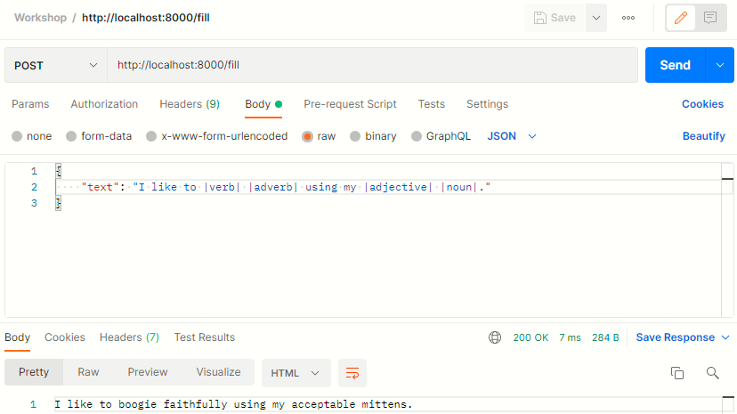
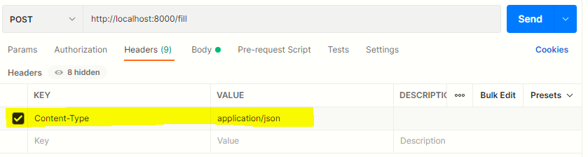

# Hack on the Hill 9 - Intro to Backend: Servers

**Date**: February 26, 2022

**Location**: Virtual

**Teacher**: [Anakin Trotter](https://github.com/AnakinTrotter)

## Resources

- [Slides](https://docs.google.com/presentation/d/113s6r2s_LHSXV0bN1K-MIkMxi8UagFDMynRB5i78BoA/edit?usp=sharing)
- [Workshop Recording](https://www.youtube.com/watch?v=dQw4w9WgXcQ)

## What we'll be learning today

- [HTTP Requests](#http-requests)
- [HTTP Responses](#http-responses)
- [Setting up your environment](#setting-up-your-environment)
- [Getting started with Express](#getting-started-with-express)

NOTE: there is a lot to cover in this workshop so if you are not familiar with JavaScript or web development, I highly recommend watching the video recording of the workshop.

## HTTP REQUESTS
HTTP (Hypertext Transfer Protocol) is a set of rules that allows clients and servers to communicate. A client refers to an individual user of the application while the server is the centralized computer that distributes data to all the clients. The most common types of HTTP requests are the GET and POST request. Every HTTP request contains a header with data about the client and a body with data that the client wants to send to the server.

### APIs
A web API (Application Programming Interface) is the software that helps the client and server communicate. For example, if you made a server for the sole purpose of giving information about different fruits, somebody who wants to display data about fruit on their app could then make a request to your API. In fact, [this API already exists!](https://www.fruityvice.com/doc/index.html)

### GET
The GET request is used for getting data from the server. A GET request has no body and can work with only a URL. An endpoint is a URL used to access specific API functionalities. Below is one endpoint from the Fruityvice API. Paste it in your browser or Postman to see what it does!

```
https://www.fruityvice.com/api/fruit/apple
```


### POST
The POST request is used for sending data from the client to the server. Unlike the GET request, the POST request contains a body with the data you want to send. Sending a POST request is a bit more involved than pasting a link into the browser. Follow the [coding tutorial](#setting-up-your-environment) for a good example!


## HTTP RESPONSES
Much like requests, responses also contain a header and body. The header contains information about the server and the body contains the data that the server is sending the client. Responses are often in JSON (JavaScript Object Notation) form like so:

```json
{
    "genus": "Malus",
    "name": "Apple",
    "id": 6,
    "family": "Rosaceae",
    "order": "Rosales",
    "nutritions": {
        "carbohydrates": 11.4,
        "protein": 0.3,
        "fat": 0.4,
        "calories": 52,
        "sugar": 10.3
    }
}
```
You may recognize the text above as the response from the Fruityvice API's apple endpoint! JavaScript objects are split into keys and values. The value before the colon is called the key and is followed by the value. To access different properties of an object in JavaScript, we can do something like this:
```js
// using the same example object from earlier
const fruitInfo = {
    "genus": "Malus",
    "name": "Apple",
    "id": 6,
    "family": "Rosaceae",
    "order": "Rosales",
    "nutritions": {
        "carbohydrates": 11.4,
        "protein": 0.3,
        "fat": 0.4,
        "calories": 52,
        "sugar": 10.3
    }
};

// printing to the console
console.log(fruitInfo.genus);
console.log(fruitInfo.nutritions.sugar);
```
The above code would output the following:
```
Malus
10.3
```
Accessing properties within an object is done with a dot. The open and closed curly braces denote objects. As you can see, it is also possible to have objects inside objects.

### Status codes
A status code is a number returned by the server to indicate whether a request was successfully responded to. Here is what some different status codes generally mean:

```
2XX (e.g. 200): Everything is good
4XX (e.g. 404): You messed up
5XX (e.g. 503): The server is broken
```

## SETTING UP YOUR ENVIRONMENT
What you will need to follow along with the demo:
- [VSCode](https://code.visualstudio.com/Download) (or an editor of your choice)
- [Node.js](https://nodejs.org/en/download/)
- [Postman](https://www.postman.com/downloads/)

NOTE: Once you finish installing Node, you can open the terminal and type:
```
node --version
```
If everything worked properly, you should see something like this:
```
v16.13.1
```
How to open the terminal for [Mac](https://support.apple.com/guide/terminal/open-or-quit-terminal-apd5265185d-f365-44cb-8b09-71a064a42125/mac) and [Windows](https://www.digitalcitizen.life/open-windows-terminal/).

[Familiarize yourself with VSCode](https://code.visualstudio.com/docs/setup/setup-overview)

[Familiarize yourself with Postman](https://learning.postman.com/docs/getting-started/introduction/)

## GETTING STARTED WITH EXPRESS
Before you begin, create a new folder anywhere you'd like and then open that folder in your editor. Then, open a terminal window in your working directory and type the following to initialize your project:
```
npm init
```
npm (node package manager) will ask you for a bunch of fields like version and author but all of them are optional so you can just spam enter if you want. Once you finish, type the next commands to install Express and Nodemon.
```
npm install express
npm install nodemon
```
Express is a library that allows us to program our server in JavaScript. Nodemon is a library that automatically restarts the server each time we save our code.

Now, in your project folder, create a new file called server.js and write the following code:
```js
const express = require('express')
const app = express()
const PORT = 8000;

app.get('/test', (req, res) => {
    res.status(200).send('Working!');
});

app.listen(PORT, () => {
    console.log(`App listening on port ${PORT}`);
});
```
[String formatting in JavaScript](https://developer.mozilla.org/en-US/docs/Web/JavaScript/Reference/Template_literals)

To handle a request in Express, you can use app.METHOD(PATH, HANDLER) where METHOD is the type of request (e.g. get/post), PATH is the URL the client should use to access this endpoint, and HANDLER is a JavaScript function. In this case, the handler function takes two parameters, the request and the response. These URLs are also called routes and defining the URLs and what they do is called routing. For more information about JavaScript functions, check out the [other workshops!](https://github.com/uclaacm/hoth9-workshops)

To run your server, you can use this terminal command:
```
nodemon server.js
```
If all is well, you should see this in the console:
```
App listening on port 8000
```
You should also be able to visit http://localhost:8000/test and see this in your browser:
```
Working!
```

### Adding functionality
```js
const words = {
    noun: ['apple', 'bicycle', 'mittens'],
    verb: ['medidate', 'boogie', 'explode'],
    adjective: ['lovely', 'smelly', 'acceptable'],
    adverb: ['quickly', 'faithfully', 'solemnly']
};

// tells Express to expect data in json format
app.use(express.json());

app.get('/words', (req, res) => {
    res.status(200).send(words);
});
```
Now that everything is working, we can add in some words we want to use for filling in Mad Libs in the future. You can also add a new words endpoint to test that everything is still working.


### Routing with parameters (Get random word of part of speech demo)
```js
// a colon after the slash indicates a parameter that the client passes in
app.get('/random/:partOfSpeech', (req, res) => {
    const { partOfSpeech } = req.params;
    const wordsOfPart = words[partOfSpeech];

    if (!wordsOfPart) {
        res.status(400).send(`ERROR: no part of speech matching ${partOfSpeech}`);
        return;
    }

    const rand = wordsOfPart[Math.floor(Math.random() * wordsOfPart.length)];
    res.status(200).send(rand);
});
```
One useful feature in Express is that you can use a colon before a part of the URL to denote it as a variable. Then, you can use req.params to retrieve the parameters from the URL. For example, in the code above, the client can pass in the part of speech as a parameter in the URL like so:
```
http://localhost:8000/random/noun
```
Try it out in Postman or your browser!

Since we put a colon before partOfSpeech, Express knows that noun is a parameter and we can use it in our code like a normal JavaScript variable.

### POST requests in Express (Fill in Mad Lib demo):
```js
// post requests have a body while get requests do not
app.post('/fill', (req, res) => {
    const { text } = req.body;

    if (!text) {
        res.status(400).send('ERROR: no text field found in body');
        return;
    }

    let result = '';
    const splitText = text.split("|");

    for (const token of splitText) {
        if (token == 'noun' || token == 'verb' 
            || token == 'adjective' || token == 'adverb') {
            const wordsOfPart = words[token];

            if (!wordsOfPart) {
                res.status(400).send(`ERROR: no part of speech matching ${token}`);
                return;
            }
        
            const rand = wordsOfPart[
                Math.floor(Math.random() * wordsOfPart.length)];
            result += rand;
        } else {
            result += token;
        }
    }

    res.status(200).send(result);
});
```
The above code is an example of a POST request in Express. Since POST requests have a body, we can use req.body to get the content of the request. From there, we can use the body data like a normal variable. This code splits the body text wherever there is a | and then replaces the words between then | with a word of that part of speech. For example, |noun| could become apple.

To test your endpoint, input your POST request into Postman and click send. You should see this:



If you do not see something like that, make sure that you included this line in your code before your routes:
```js
app.use(express.json());
```
Also make sure that you defined the Content-Type as application/json in your POST request header like so:



If everything looks right at this point, then you are good to go!

Congratulations on learning the backend!
